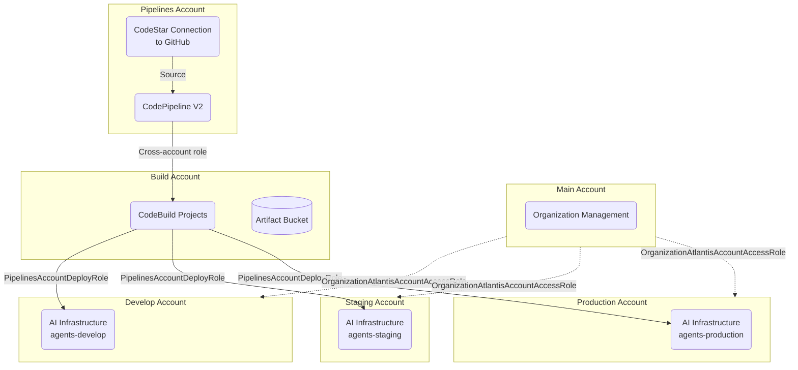

ClarusWMS extends its warehouse management platform with an AI layer built on **AWS Bedrock AgentCore**. This layer gives two distinct audiences a way to interact with the WMS through natural language:

- **External MCP clients** like Claude Desktop or ChatGPT connect through a public MCP gateway to query warehouse data — think of it as a read-only API for AI assistants.
- **The Clarus frontend AI application** uses an internal Strands-based Python agent runtime with full tool access through a private gateway — this powers the embedded chat experience with richer capabilities like CSV exports and file analysis.

Authentication flows through an existing **Cognito user pool**, while a **CloudFront distribution** provides a unified custom domain with path-based routing and Lambda@Edge functions that bridge Cognito's OAuth implementation with the MCP protocol's requirements. The AI infrastructure runs in **us-east-1** as several required services aren't yet available in our preferred eu-west-2 region.

<Note>
The AI infrastructure spans two repositories: **ClarusWMS_Agents** contains all application code (Lambdas, agent runtime, tool schemas), while **ClarusWMS_OPS** contains the Terraform infrastructure definitions.
</Note>

## High-Level Architecture

When a request arrives — whether from an external MCP client or the frontend app — it enters through Route53 DNS and hits CloudFront, which routes it to the appropriate backend based on the URL path. Here's how all the pieces connect:

<Frame>
  
</Frame>

<sub>Click the diagram to zoom and pan. <a href="/images/ai-architecture-overview.svg" download="claruswms-ai-architecture.svg">Download SVG</a> · <a href="/images/ai-architecture-overview.drawio" download="ai-architecture-overview.drawio">Download draw.io source</a></sub>

## AWS Account Architecture

Each environment runs in a **dedicated AWS account**. A shared Pipelines account triggers builds via CodePipeline V2, and CodeBuild deploys cross-account using IAM roles. Terraform manages resources in each account via an organization-level access role.



The pipeline and build accounts are **shared infrastructure** used by all ClarusWMS services — they're not AI-specific.

## Explore the Architecture

<CardGroup cols={3}>
  <Card title="Infrastructure" icon="server" href="/architecture/ai/infrastructure">
    CloudFront, Cognito, Lambda@Edge, and the MCP Interceptor
  </Card>
  <Card title="Gateways" icon="split" href="/architecture/ai/gateways">
    Dual MCP gateway architecture and request routing
  </Card>
  <Card title="Agent Runtime" icon="microchip" href="/architecture/ai/runtime">
    The Strands Python agent powering AI conversations
  </Card>
  <Card title="Authentication" icon="shield-halved" href="/architecture/ai/authentication">
    OAuth flows, multi-tenant routing, and token management
  </Card>
  <Card title="MCP Tools" icon="wrench" href="/architecture/ai/tools">
    Tool inventory, dispatch pattern, and shared library
  </Card>
  <Card title="Sessions & Memory" icon="database" href="/architecture/ai/sessions">
    Session persistence, semantic memory, and warmup
  </Card>
  <Card title="Frontend Integration" icon="browser" href="/architecture/ai/frontend">
    Embedding, file uploads, rich rendering, and SSE streaming
  </Card>
  <Card title="Deployment" icon="rocket" href="/architecture/deployment/index">
    CI/CD pipelines and multi-account deployment
  </Card>
</CardGroup>

<Accordion title="CloudFront Routing Table">
CloudFront evaluates path-based cache behaviors in order. More specific patterns (like `/oauth2/authorize`) are defined before broader ones (like `/oauth2/*`) to ensure correct handling.

| Path Pattern | Origin | Lambda@Edge / CF Function | Event Type |
|---|---|---|---|
| `/mcp*` | Public MCP Gateway | Tenant Extractor (CF Function) | viewer-request |
| `/mcp*` | Public MCP Gateway | MCP Response Rewrite | origin-response |
| `/mcp-internal*` | Private MCP Gateway | MCP Response Rewrite | origin-response |
| `/agent*` | Bedrock AgentCore data plane | Agent Request Rewrite | origin-request |
| `/oauth2/authorize` | Cognito | OAuth Authorize Rewrite (strips `resource` param) | viewer-request |
| `/oauth2/*` | Cognito | None | - |
| `/oauth2/register` | N/A (intercepted) | OAuth Metadata Lambda (handles DCR) | origin-request |
| `/.well-known/*` | N/A (intercepted) | OAuth Metadata Lambda (serves metadata) | origin-request |
| `/login` | Cognito | None | - |
| `/logout` | Cognito | None | - |
| Default | Cognito | None | - |
</Accordion>

<Accordion title="S3 Bucket Structure">
### Unified Agents Bucket: `claruswms-{prefix}-agents`

```
claruswms-{prefix}-agents/
  clarus-mcp-api.zip                  # API Lambda deployment package
  clarus-mcp-utils.zip                # Utils Lambda deployment package
  mcp-interceptor.zip                 # Interceptor Lambda deployment package
  clarus-mcp-api-tools.json           # API tool schema (JSON array)
  clarus-mcp-utils-tools.json         # Utils tool schema (JSON array)
  clarus_agent/
    deployment.zip                     # Agent runtime deployment package
  schema/
    graphql-schema/                    # Parsed GraphQL schema files
    rest-schema/                       # Parsed REST API schema files
  context/                             # Context files for Lambda runtime
  agent-sessions/                      # Agent conversation state (1-day TTL)
```

- **Versioning**: Enabled
- **Encryption**: AES256 with bucket key
- **Lifecycle**: Old versions cleaned after 30 days; `agent-sessions/` prefix expires after 1 day
- **Public access**: All blocked

### Generated Files Bucket: `claruswms-{prefix}-mcp-generated`

```
claruswms-{prefix}-mcp-generated/
  datasets/{uuid}.ndjson               # GraphQL query results (NDJSON, 1-hour TTL)
  exports/{timestamp}_{filename}       # Generated CSV files
```

- **Versioning**: Disabled
- **Encryption**: AES256
- **Lifecycle**: All objects expire after 7 days
- **Public access**: All blocked
- **Purpose**: Temporary storage for files generated during AI conversations (datasets, CSV exports)
</Accordion>
