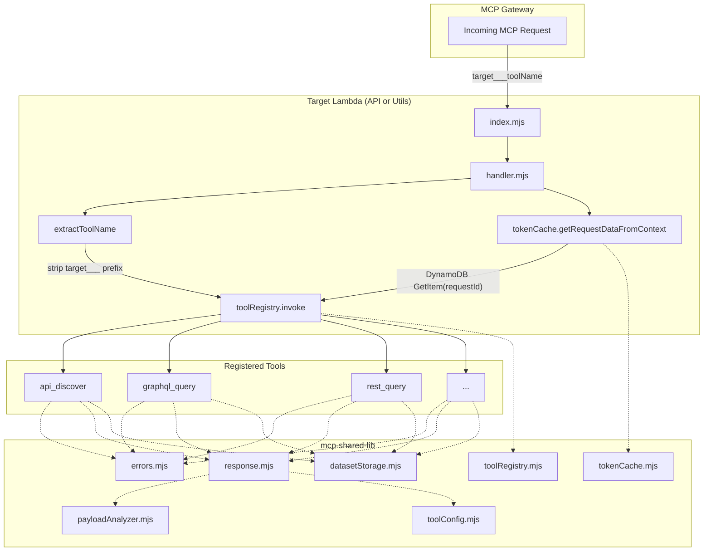

Tools are how the AI layer interacts with the ClarusWMS backend. When the agent needs to look up orders, inspect a schema, or generate a CSV, it makes an MCP tool call that gets dispatched to one of two Lambda functions. This page covers what tools exist, how they're invoked, and the shared library that ties them together.

## Tool Lambdas

### API Lambda (clarus-mcp-api)

The API Lambda handles all GraphQL and REST operations against the WMS. It's the primary tool backend, exposed through **both** gateways.

| | |
|---|---|
| **Role** | MCP tool handler for GraphQL/REST operations against the WMS |
| **Key config** | Node.js 22.x, 512MB memory, 60s timeout, `live` alias |
| **Connects to** | GraphQL replica endpoint, REST API endpoint, S3 (schemas), DynamoDB (token cache) |

Key behaviors:
- **GraphQL relay pagination**: All list queries use the Relay Connection pattern. The `first` argument is capped at 100 per page unless `limit` is set to raise the ceiling. Pagination continues via `after: endCursor`.
- **Dataset storage**: When a GraphQL query returns array data, results are automatically stored in S3 as NDJSON. The tool response includes a `_datasetRef` UUID and a sample of the first 3-10 records. Datasets expire after 1 hour.
- **Schema caching**: GraphQL and REST schema files loaded from S3 are cached in-memory with a 10-minute TTL and 200-entry LRU limit.

### Utils Lambda (clarus-mcp-utils)

The Utils Lambda provides internal utility tools that are only accessible through the **private gateway**. External clients cannot reach these tools, preventing unmetered access to resource-intensive operations.

| | |
|---|---|
| **Role** | Internal utility tools (CSV file generation, dataset retrieval) |
| **Key config** | Node.js 22.x, 512MB memory, 60s timeout, `live` alias |
| **Connects to** | S3 (generated files bucket), DynamoDB (token cache) |

Key behaviors:
- **CSV generation**: Takes a `datasetRef` UUID from a prior query, downloads NDJSON from S3, maps columns via `{ path, title }` definitions (supporting dot-notation), generates RFC 4180-compliant CSV with UTF-8 BOM for Excel compatibility, and returns a presigned download URL valid for 1 hour.
- **Dataset retrieval**: Provides paginated access to stored datasets with `limit` (max 500), `offset`, and `fields` (dot-notation projection).

## Tool Inventory

### API Lambda Tools (both gateways)

| Tool | Type | Description |
|---|---|---|
| `api_discover` | Navigation | Search both GraphQL and REST endpoints by keyword, synonym, or intent |
| `graphql_details` | Schema inspection | Get complete query/method details including fields, filters, and pagination info |
| `graphql_type` | Schema inspection | Inspect nested GraphQL type structure and field definitions |
| `graphql_query` | Execution | Execute read-only GraphQL queries with automatic dataset storage |
| `rest_details` | Schema inspection | Get REST endpoint request/response schema with FK resolution guidance |
| `rest_query` | Execution | Execute REST API calls (GET, POST, PUT, PATCH, DELETE) |

### Utils Lambda Tools (private gateway only)

| Tool | Description | In gateway schema |
|---|---|---|
| `list_tools` | Meta-tool for discovering available tools and their schemas | No (internal only) |
| `create_csv_file` | Generate CSV from stored dataset, return presigned download URL | Yes |
| `retrieve_dataset` | Paginated retrieval of stored datasets with field projection | Yes |

## Tool Schema Format

Tool schemas are JSON arrays generated by scripts that dynamically import each Lambda's tools module. Each entry contains `name`, `description`, and `inputSchema` (JSON Schema). The `list_tools` tool is explicitly excluded from generated schemas since it's only used for internal discovery within the Utils Lambda.

The generated schema files (`clarus-mcp-api-tools.json`, `clarus-mcp-utils-tools.json`) are uploaded to S3 and referenced by gateway targets.

## MCP Tool Handler Dispatch

Both Lambda targets share the same handler pattern via a shared library (`mcp-shared-lib`). Here's how a tool call flows through the Lambda:

The dispatch follows five steps:

1. **Cold start**: Tools registered via `registry.registerAll(tools)`, optional `initializeAll()` for tools with setup functions
2. **Tool name extraction**: Gateway prefixes tool names with `{target_name}___`. The handler strips everything before and including `___`
3. **Context building**: `tokenCache.getRequestDataFromContext(context)` retrieves `{ token, subdomain }` from DynamoDB using the request ID from Lambda context
4. **Dispatch**: `registry.invoke(toolName, event, toolContext)` looks up the handler and executes it
5. **Response formatting**: `response.success()` applies per-tool payload optimization (configurable modes: FULL, CONDENSED, MINIMAL, AUTO) before returning MCP-formatted results

## Shared Library Modules

All tool Lambdas share `mcp-shared-lib`, which provides common functionality:

| Module | Purpose |
|---|---|
| `toolRegistry.mjs` | Map-based tool registration, lookup, and invocation |
| `tokenCache.mjs` | DynamoDB client for retrieving cached JWT tokens and subdomains |
| `errors.mjs` | Error type hierarchy with MCP response formatting |
| `response.mjs` | MCP response formatting with automatic payload optimization |
| `datasetStorage.mjs` | S3 NDJSON dataset storage, retrieval, and metadata extraction |
| `payloadAnalyzer.mjs` | Payload size analysis, truncation, and summarization |
| `toolConfig.mjs` | Per-tool configuration for payload behavior (mode, threshold, sample size) |

## Error Handling

Lambda tool errors follow a typed hierarchy. All errors serialize to MCP format via `.toResponse()`, ensuring the AI model can read and act on error details:

| Error Class | Code | HTTP Status | Use Case |
|---|---|---|---|
| `ToolError` | Custom | 400 | Base class for custom tool errors |
| `MissingParameterError` | MissingParameter | 400 | Required parameter not provided |
| `InvalidParameterError` | InvalidParameter | 400 | Parameter value invalid (includes valid values in details) |
| `NotFoundError` | NotFound | 404 | Resource not found (includes suggestions) |
| `ConfigurationError` | ConfigurationError | 500 | Missing environment variables or S3 buckets |
| `ExternalServiceError` | ExternalServiceError | 502 | Backend API or S3 failure |

GraphQL errors are handled differently — they're returned inline (not thrown) with `hasErrors: true` and an errors array. This allows the AI model to see partial results alongside error details and decide how to proceed.
