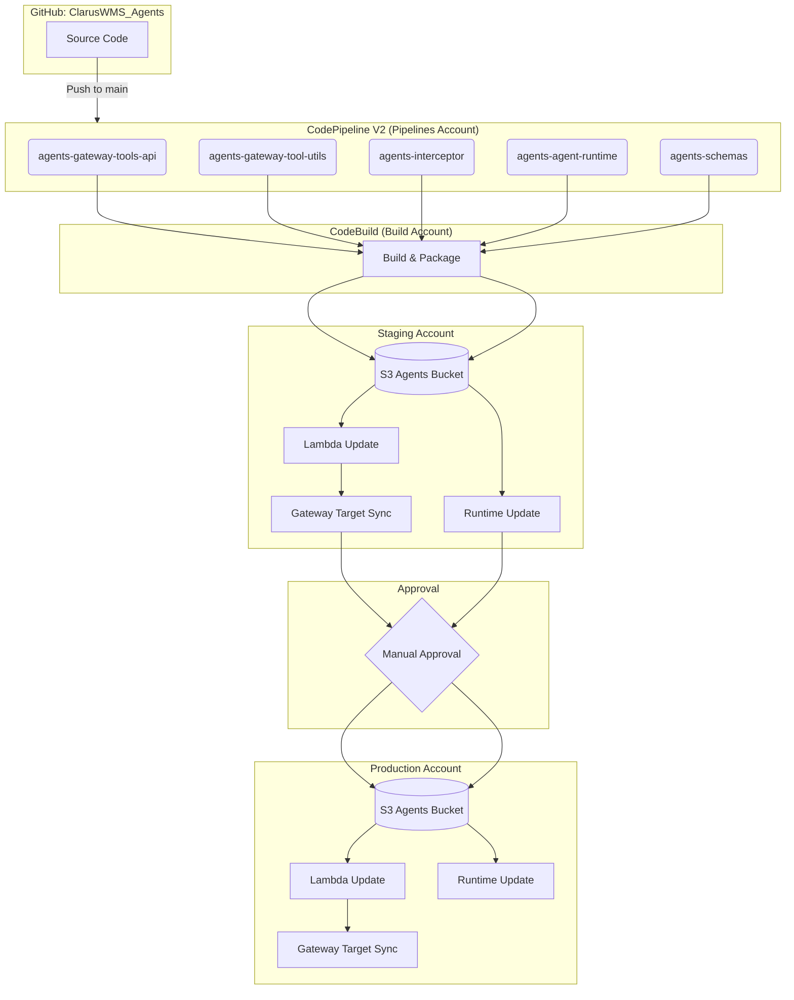

All AI application code lives in the **ClarusWMS_Agents** GitHub repository. Five separate pipelines handle different components, triggered by file path filters on the `main` branch.

## Source Directories

| Directory | Produces | Description |
|---|---|---|
| `clarus-mcp-api/` | `clarus-mcp-api.zip` | API Lambda — GraphQL/REST operations against the WMS |
| `clarus-mcp-utils/` | `clarus-mcp-utils.zip` | Utils Lambda — CSV generation, internal utilities |
| `mcp-interceptor/` | `mcp-interceptor.zip` | Interceptor Lambda — JWT token caching |
| `agent-runtime/` | `clarus_agent/deployment.zip` | Agent runtime — Strands Python agent |
| `api-parser/` | Schema files | GraphQL/REST schema parsing scripts |
| `scripts/generators/generate-tool-schema-api.mjs` | `clarus-mcp-api-tools.json` | Tool schema for API Lambda |
| `scripts/generators/generate-tool-schema-utils.mjs` | `clarus-mcp-utils-tools.json` | Tool schema for Utils Lambda |

## Pipeline Architecture

Each pipeline follows the same pattern: source change triggers a build in the shared Build account, which deploys to staging, waits for manual approval, then deploys to production.

## Pipeline Triggers

Each pipeline watches specific file paths on the `main` branch:

| Pipeline | Trigger paths |
|---|---|
| `agents-gateway-tools-api` | `clarus-mcp-api/**`, `buildspecs/gateway-tool-api-*`, `generate-tool-schema-api.mjs` |
| `agents-gateway-tool-utils` | `clarus-mcp-utils/**`, `buildspecs/gateway-tool-utils-*`, `generate-tool-schema-utils.mjs` |
| `agents-interceptor` | `mcp-interceptor/**`, `buildspecs/interceptor-*` |
| `agents-agent-runtime` | `agent-runtime/**`, `buildspecs/agent-runtime-*` |
| `agents-schemas` | `api-parser/**`, `buildspecs/schemas-*` |

## Deployment Steps (Lambda Tools)

<Steps>
  <Step title="Build & Package">
    CodeBuild produces a zip artifact from the source directory.
  </Step>
  <Step title="Deploy to S3">
    The zip is deployed to the S3 agents bucket in the target account via a cross-account IAM role.
  </Step>
  <Step title="Update Lambda">
    Lambda function code is updated using the new zip from S3.
  </Step>
  <Step title="Publish & Alias">
    A new Lambda version is published and the `live` alias is updated to point to it.
  </Step>
  <Step title="Sync Gateway Targets">
    The tool schema is regenerated and the gateway target configuration is updated to reflect any tool changes.
  </Step>
</Steps>

<Note>
The pipeline and build accounts are **shared infrastructure** used by all ClarusWMS services. They are not AI-specific — the same CodePipeline and CodeBuild setup handles deployments for other services as well.
</Note>
